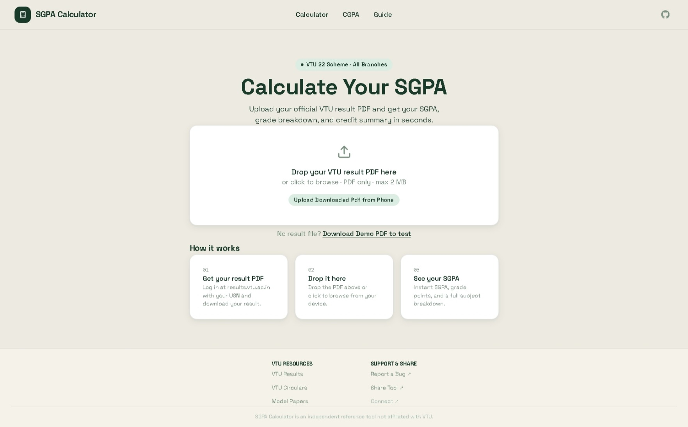
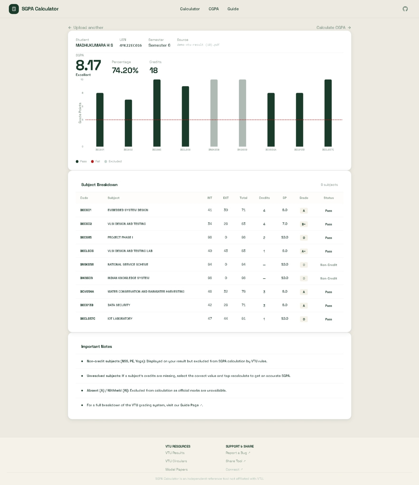
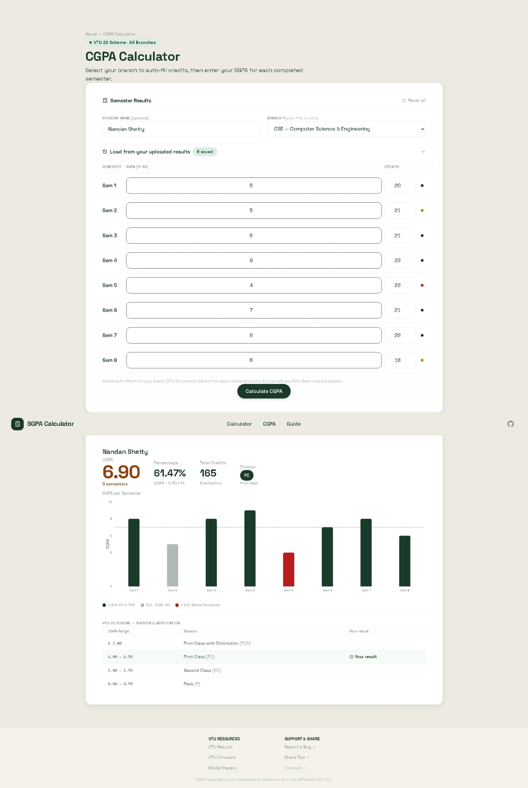

# VTU SGPA Calculator

> **Upload your official VTU result PDF. Get your SGPA, grade breakdown, credit summary, and CGPA trend instantly — no signup, no data stored.**

[](https://vtucalc.in)
[](LICENSE)
[](https://github.com/Nandan1234567/SGPA-CALCULATOR/actions)
[](https://github.com/Nandan1234567/SGPA-CALCULATOR/stargazers)
[](https://github.com/Nandan1234567/SGPA-CALCULATOR/issues)

**[→ Try it live at vtucalc.in](https://vtucalc.in)**

---

## The Problem

VTU result PDFs contain raw marks and grades — but no SGPA. Students manually look up the credit weight for each subject (which varies by branch, semester, and scheme), then do weighted arithmetic across 7–9 subjects. It is error-prone, tedious, and repeated every semester by hundreds of thousands of students.

This tool eliminates that entirely. Drop the PDF. SGPA is computed in seconds. The app resolves subject credits from a master database, handles non-credit subjects (NSS, PE, Yoga), and excludes absent and withheld entries — exactly as VTU's grading rules specify.

---

## Screenshots
<p align="center">
  
  &nbsp;&nbsp;
  
  &nbsp;&nbsp;
  
</p>

## Features

- **PDF Upload** — Drop your official VTU result PDF; SGPA is computed automatically with subject name resolution, grade classification, and credit handling
- **Manual Entry** — Enter marks directly if you don't have the PDF yet
- **CGPA Tracker** — Enter SGPA per semester; the app auto-fills credits per branch and computes cumulative GPA with division classification
- **Subject Credit Resolver** — Every VTU 22 Scheme subject code mapped to its credit weight in the database
- **All Branches** — CSE, ECE, ME, Civil, ISE, EEE covered under VTU 22 Scheme
- **Zero Data Retention** — PDFs are parsed in memory by the Flask service and discarded immediately. Nothing is persisted
- **Mobile First** — Full responsive design; tested on Android Chrome and iOS Safari
- **Offline-Ready Structure** — React SPA served from Nginx; only API calls require network

---

## Architecture

```
Internet
    │
    ▼
[Cloudflare]             WAF · DDoS absorption · Global CDN · SSL offload
    │  HTTPS
    ▼
[Nginx :443]             SSL termination · Static file serving · Rate limiting
    │                    Cloudflare real-IP restoration · Gzip/Brotli compression
    │
    ├── /                → React SPA (built into Nginx image at deploy time)
    │                      HTML/JS/CSS served directly from container filesystem
    │
    └── /api/*           → ASP.NET Core :8080
                                │
                                ├── PostgreSQL :5432
                                │     Subject master data (22 Scheme)
                                │     Credit weights, scheme metadata
                                │
                                └── Flask (Gunicorn) :5050
                                      PDF text extraction — pdfplumber
                                      4 sync workers for concurrency
                                      [Circuit breaker] — ASP.NET isolates
                                      automatically on repeated failure
```

All backend containers communicate over a private Docker bridge network (`sgpa_net`). Nothing except Nginx is exposed to the public internet. The VPS IP is hidden behind Cloudflare — direct IP access is blocked at the firewall level.

**Request lifecycle for a PDF upload:**

```
Browser  →  Cloudflare edge  →  Nginx  →  ASP.NET Core
                                                │
                                          Validates request
                                          Streams PDF bytes  →  Flask /extract
                                                                      │
                                                               pdfplumber parses
                                                               Returns structured JSON
                                                │
                                          Resolves credits from PostgreSQL
                                          Computes SGPA (weighted average)
                                          Returns result — PDF bytes discarded
```

---

## Tech Stack

| Layer | Technology | Why This Choice |
|---|---|---|
| Frontend | React 18 + TypeScript + Vite | Strict types eliminate a class of runtime bugs; Vite's build pipeline produces optimally split chunks |
| Backend API | ASP.NET Core (.NET 9) + C# | Strongly typed end-to-end; EF Core migrations give reliable schema evolution; .NET 9 benchmarks comparably to Go for API workloads |
| PDF Service | Python 3.12 + pdfplumber + Gunicorn | pdfplumber is the most accurate PDF text extraction library available; Python-native, best-in-class for structured PDF parsing |
| Database | PostgreSQL 16 | ACID guarantees; excellent Npgsql/.NET provider; free at any scale vs SQL Server |
| Reverse Proxy | Nginx 1.27 (Alpine) | Static files served at zero application overhead; rate limiting, Cloudflare IP trust, and SSL termination handled outside application code |
| SSL | Let's Encrypt + Certbot | Free; auto-renews every 60 days; certbot runs as a sidecar container |
| CDN / WAF | Cloudflare Free Tier | DDoS absorption; global edge cache; hides VPS IP; Bot Fight Mode; real IP restoration headers |
| Containerisation | Docker + Docker Compose | Reproducible environments across dev and prod; isolated service restarts; clean rebuild path |


---

## Engineering Highlights

These are the non-obvious decisions in the system — the ones that prevent failures at scale.

### Circuit Breaker on the PDF Microservice

The ASP.NET Core backend implements a circuit breaker around all calls to the Flask PDF service. If Flask returns consecutive errors (crash, OOM, timeout), the breaker opens and subsequent requests immediately get a `503` with a clear error message rather than waiting for a timeout cascade. The breaker half-opens after 30 seconds to probe for recovery. This keeps the rest of the API (CGPA calculation, subject lookup) healthy even when the PDF service is unhealthy.

### Zero Data Retention by Design

Privacy is enforced at the architecture level, not just in a privacy policy. The Flask service receives the PDF bytes, extracts text using pdfplumber in memory, and returns structured JSON. The PDF is never written to disk. ASP.NET Core never stores the extraction result. PostgreSQL contains only the subject master data seeded at startup — no user data ever enters it. There is no session storage, no logging of student names or USNs.

### EF Core Migrations on Startup

The backend container runs `Database.MigrateAsync()` during application startup before accepting requests. This means deployments are zero-touch schema changes — no separate migration step, no manual SQL. Docker's health check dependency (`depends_on: condition: service_healthy`) ensures ASP.NET only starts after PostgreSQL passes its health probe.

### Nginx as the Single Public Ingress

Nginx serves the React build (static HTML/JS/CSS) directly from the container filesystem at zero ASP.NET overhead. It also handles rate limiting (`10r/m` on API routes, `5r/m` on the upload endpoint), Cloudflare real-IP restoration (`set_real_ip_from`), and enforces request size limits before a byte reaches application code. ASP.NET only sees valid, rate-passed, real-IP-tagged requests.

### Gunicorn Multi-Worker Concurrency

pdfplumber is CPU-bound and synchronous. A single-process Flask server would serialise PDF uploads. Running 4 Gunicorn sync workers means 4 PDFs can be parsed in parallel. `--max-requests 500` restarts workers periodically to avoid memory leaks from pdfplumber's internal PDF state accumulation.

### Cloudflare at the Edge

Cloudflare caches the React SPA at 200+ edge locations globally. On VTU result days — when traffic spikes 10–20x — the edge absorbs static asset requests and the origin only sees API traffic. Bot Fight Mode and WAF rules (SQL injection, XSS patterns) are enforced before traffic reaches the VPS.

---

## Project Structure

```
sgpa-calculator/
│
├── backend/                         ASP.NET Core Web API (.NET 9)
│   ├── Application/
│   │   ├── Interfaces/              Contract definitions (ISubjectRepository, ISgpaService)
│   │   ├── Services/                Business logic: SGPA computation, credit resolution
│   │   └── DTOs/                    Request/response shapes
│   ├── Infrastructure/
│   │   ├── Persistence/             EF Core DbContext, repositories, migrations
│   │   └── ExternalServices/        Flask HTTP client + circuit breaker
│   ├── Middleware/                  Global error handler, request size limiter
│   ├── Migrations/                  EF Core migration history
│   └── Dockerfile                   Multi-stage: build → publish → runtime
│
├── frontend/                        React 18 + TypeScript + Vite
│   ├── src/
│   │   ├── api/                     Axios client, typed request/response models
│   │   ├── components/              Reusable UI (Chart, SubjectTable, FileDropzone)
│   │   ├── routes/                  Page-level components (Calculator, CGPA, Guide)
│   │   ├── hooks/                   Custom hooks (useSgpaCalculation, useFileUpload)
│   │   ├── types/                   TypeScript interfaces for domain models
│   │   └── constants/               Grade point map, scheme config, validation rules
│   └── public/
│       ├── sitemap.xml              Google Search Console
│       └── robots.txt
│
├── flask-service/                   Python PDF extraction microservice
│   ├── flask_app.py                 Flask app + Gunicorn entry point + health endpoint
│   ├── requirements.txt
│   └── Dockerfile
│
├── nginx/                           Reverse proxy + static file server
│   ├── Dockerfile                   Multi-stage: build React → copy output → Nginx Alpine
│   ├── nginx.conf                   Worker config, log format, Cloudflare IP trust
│   └── conf.d/
│       ├── app.conf                 HTTP-only (used during initial SSL bootstrap)
│       └── app.ssl.conf             Full HTTPS: rate limits, proxy rules, static serving
│
├── postgres/
│   └── init.sql                     pg_stat_statements extension, slow query logging
│
├── scripts/
│   ├── init-ssl.sh                  First-time Let's Encrypt certificate acquisition
│   ├── backup-db.sh                 Daily pg_dump with timestamp rotation
│   └── health-check.sh             Checks all services and prints status summary
│
│
├── docker-compose.prod.yml          Production service definitions
├── docker-compose.yml               Local development compose
├── docker-compose.override.yml      Local port overrides (hot reload, dev tools)
├── .env.example                     Variable template — copy to .env, never commit .env

```

---

## Local Development

### Prerequisites

- [Docker Desktop](https://www.docker.com/products/docker-desktop/) — includes Compose
- Node.js 20+ (only if running frontend outside Docker)
- .NET 9 SDK (only if running backend outside Docker)
- Python 3.12+ (only if running Flask outside Docker)

### 1. Clone

```bash
git clone https://github.com/Nandan1234567/SGPA-CALCULATOR.git
cd SGPA-CALCULATOR
```

### 2. Configure environment

```bash
cp .env.example .env
# .env.example defaults work as-is for local development
# Generate a strong DB password if desired:
openssl rand -base64 32
```

### 3. Start with Docker (recommended)

```bash
docker compose up --build
```

This starts all four services. Migrations run automatically.

| Service | URL |
|---|---|
| Frontend (React) | http://localhost:80 |
| Backend (ASP.NET Core) | http://localhost:5100 |
| PDF Service (Flask) | http://localhost:5050 |
| PostgreSQL | localhost:5432 |

### 4. Start services individually (without Docker)

**Backend:**

```bash
cd backend
dotnet restore
dotnet run
# http://localhost:5100
```

**Frontend:**

```bash
cd frontend
npm install
echo "VITE_API_BASE_URL=http://localhost:5100" > .env.local
npm run dev
# http://localhost:5173
```

**Flask service:**

```bash
cd flask-service
python -m venv venv
source venv/bin/activate          # Windows: venv\Scripts\activate
pip install -r requirements.txt
python flask_app.py
# http://localhost:5050
```

### 5. Verify

```bash
curl http://localhost:5100/health   # {"status":"Healthy",...}
curl http://localhost:5050/health   # {"status":"ok"}
```

---

## Environment Variables

Copy `.env.example` to `.env`. Never commit `.env`.

| Variable | Required | Default | Description |
|---|---|---|---|
| `POSTGRES_DB` | Yes | `sgpa_db` | Database name |
| `POSTGRES_USER` | Yes | `sgpa_user` | Database user |
| `POSTGRES_PASSWORD` | **Yes** | — | Strong password — generate with `openssl rand -base64 32` |
| `DOMAIN` | Yes (prod) | — | Your domain, e.g. `vtucalc.in` |
| `FRONTEND_URL` | Yes (prod) | — | Full URL with scheme, e.g. `https://vtucalc.in` |
| `CERTBOT_EMAIL` | Yes (prod) | — | Email for Let's Encrypt SSL cert expiry notifications |

---

## Architecture Decision Records

### Why ASP.NET Core instead of Node.js or Python for the API?

Strong typing in C# eliminates a category of runtime bugs that TypeScript/Python catch only at test time or in production. EF Core's migration system is the most mature ORM migration tool available — schema changes are versioned, repeatable, and run automatically on startup. .NET 9 HTTP throughput is comparable to Go and significantly faster than Node.js for CPU-bound request handling.

### Why a dedicated Flask microservice for PDF parsing?

pdfplumber is Python-only and is objectively the best library for structured PDF text extraction — the accuracy gap over Apache PDFBox or iTextSharp is significant for VTU's PDF format. Calling Python from C# as a subprocess is fragile and undeployable in Docker. A separate HTTP microservice gives clean interface boundaries, independent scaling (add Gunicorn workers), crash isolation (a pdfplumber OOM does not take down the API), and replaceability (swap pdfplumber for any other tool without touching ASP.NET).

The circuit breaker in ASP.NET means the API degrades gracefully when the PDF service is unavailable rather than cascading failures.

### Why PostgreSQL over SQL Server or SQLite?

SQL Server licensing is prohibitively expensive on a VPS. SQLite cannot handle concurrent writes safely and has no connection pooling. PostgreSQL is production-grade, ACID-compliant, free at any scale, and has the best .NET provider (Npgsql). EF Core's PostgreSQL support is first-class.

### Why Nginx in front of ASP.NET Core instead of exposing Kestrel directly?

Nginx is purpose-built for static file serving. The entire React SPA — HTML, JS, CSS, assets — is served directly from Nginx's in-memory cache with zero ASP.NET involvement. This eliminates a significant load category from the application server. Nginx also handles: SSL termination (Kestrel sees only HTTP internally), rate limiting (configured once at the edge, not duplicated in middleware), Cloudflare IP restoration, request body size validation, and Brotli/gzip compression — all outside application code.

### Why Docker Compose over Kubernetes?

A single-VPS workload with four services has no need for the operational complexity of Kubernetes. Docker Compose gives reproducible environments, isolated networking, volume-managed persistence, and simple rebuild/restart semantics at a fraction of the operational overhead. If traffic grows to require horizontal scaling, the migration path is clear: Nginx → ALB, each service → its own managed container group (ECS, Cloud Run, or a minimal k3s cluster).

---

## Contributing

Contributions are welcome. Here is how to do it correctly.

### Reporting a Bug

1. Check [existing issues](https://github.com/Nandan1234567/SGPA-CALCULATOR/issues) first
2. Open a [new issue](https://github.com/Nandan1234567/SGPA-CALCULATOR/issues/new) with:
   - What happened (exact error or wrong output)
   - What you expected
   - Steps to reproduce (which branch, which semester, which PDF type)
   - Screenshot if it is a UI issue

### Requesting a Feature

Open an issue labelled `enhancement`. Describe the problem you need solved, not the implementation — the best solution is often not obvious upfront.

### Submitting a Pull Request

```bash
# 1. Fork the repository on GitHub

# 2. Clone your fork
git clone https://github.com/YOUR_USERNAME/SGPA-CALCULATOR.git
cd SGPA-CALCULATOR

# 3. Create a branch — name it after what you are changing
git checkout -b fix/pdf-parsing-21-scheme
git checkout -b feat/cgpa-export-pdf
git checkout -b chore/upgrade-dotnet-10

# 4. Make your changes

# 5. Test locally
docker compose up --build
# Manually verify the change end-to-end

# 6. Commit using Conventional Commits
git commit -m "fix: handle 21-scheme subject codes in PDF parser"
# Prefixes: feat · fix · chore · docs · refactor · test · perf

# 7. Push and open a PR against main
git push origin fix/pdf-parsing-21-scheme
```

**PR checklist:**

- [ ] Tested locally with `docker compose up --build`
- [ ] No TypeScript errors (`npm run type-check`)
- [ ] No `any` types, no hardcoded secrets, no dead code
- [ ] Commit messages follow `type: description` convention
- [ ] PR description explains what changed and why

### Branch Naming

```
feat/add-21-scheme-support
fix/nginx-cors-header
chore/upgrade-dotnet-10
docs/update-ops-runbook
refactor/pdf-extractor-cleanup
perf/subject-lookup-index
```

---

## Security

- **Zero storage** — no student name, USN, or marks data is persisted anywhere
- **Rate limiting** — enforced at Nginx: 10 req/min on API routes, 5 req/min on upload endpoint
- **Cloudflare WAF** — SQL injection, XSS, and known exploit patterns blocked at the edge
- **Private Docker network** — only Nginx is reachable from outside; PostgreSQL and Flask have no public ports
- **Secrets via environment variables** — `.env` is excluded from git; no credentials in source code
- **Request size limits** — enforced at Nginx before reaching application code; prevents oversized payload attacks
- **HTTPS enforced** — HTTP to HTTPS redirect at both Nginx and Cloudflare levels; HSTS enabled

To report a security vulnerability, email directly rather than opening a public issue.

---

## Roadmap

- [ ] VTU 22 Scheme support (subject master data + PDF format handling)
- [ ] Sentry error tracking (frontend JavaScript exceptions with full stack traces)
- [ ] Structured JSON logging on backend (Serilog — grep by field instead of text search)
- [ ] Off-site database backup to Cloudflare R2 (current: daily pg_dump to local disk only)
- [ ] CI lint and type-check gate before deploy (currently post-push only)
- [ ] SGPA result PDF export (shareable result card)
- [ ] CGPA trend graph across semesters on the result page

---

## License

MIT — see [LICENSE](LICENSE) for details.

---

## Author

**Nandan Shetty**

[@Nandan1234567](https://github.com/Nandan1234567) · [vtucalc.in](https://vtucalc.in)

Built as a full production-lifecycle project: containerised microservices, circuit breaker pattern, CI/CD with automated rollback, SSL automation, CDN/WAF configuration, SEO, and observability.

---

*If this saved you time, a ⭐ helps other VTU students find it.*

[](https://github.com/Nandan1234567/SGPA-CALCULATOR)
